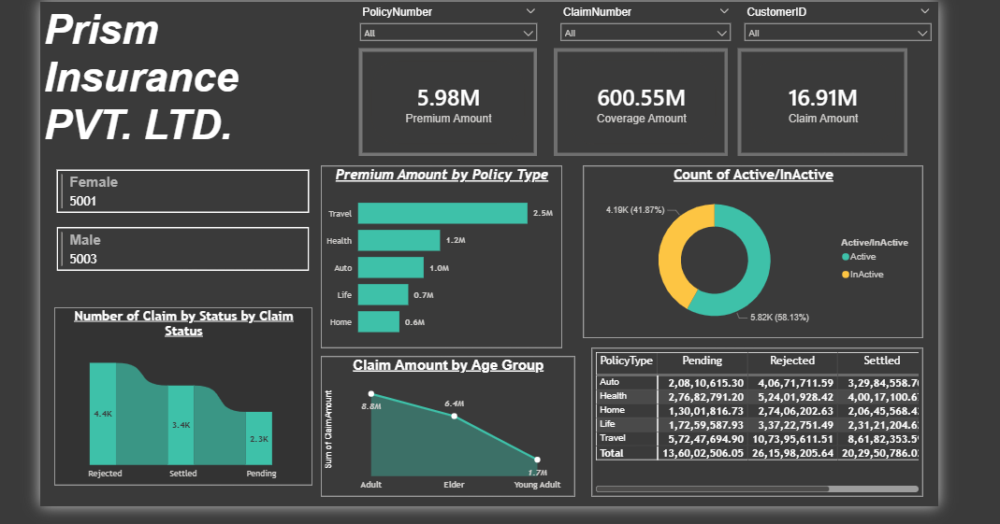
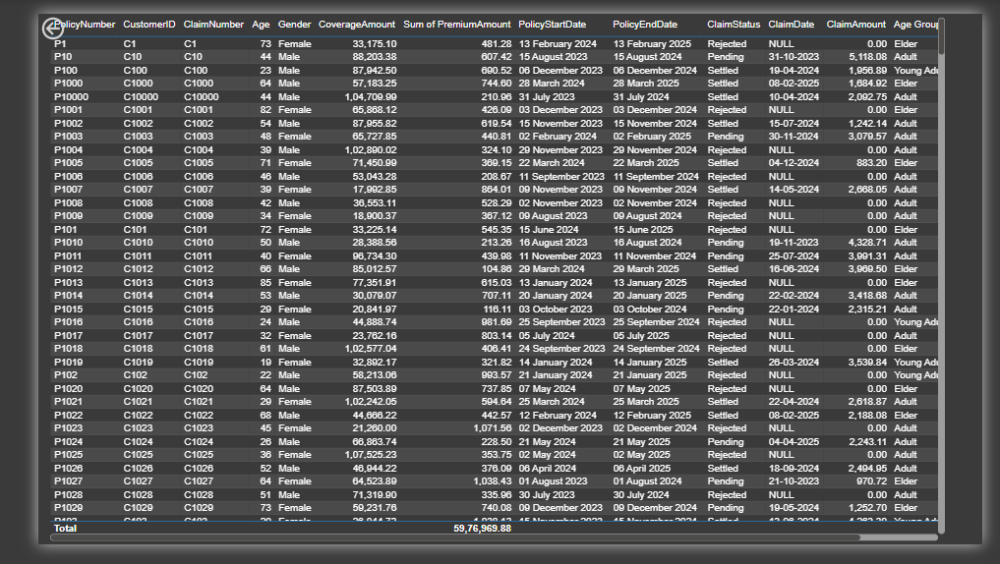
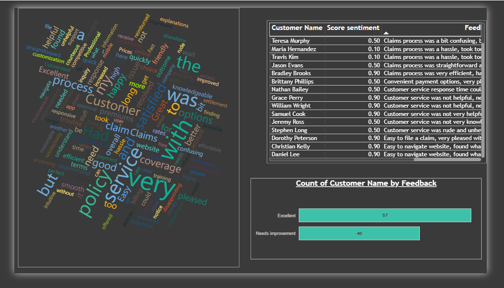

Insurance Risk Analytics Dashboard

Insurance Claims and Risk Analytics Dashboard using Power BI, SQL, Python, and Excel

Introduction

As a Data Analyst, I developed an interactive Insurance Risk Analytics Dashboard using Power BI, SQL, Python, and Excel to analyze policy performance, claim trends, customer sentiment, and business risk indicators. The objective was to transform raw insurance data into actionable insights that support decision-making, customer experience improvement, and risk monitoring.

Business Requirements

The insurance business required visibility into policy performance across different insurance products, premium collection and coverage trends, claim settlement, rejection and pending claim analysis, customer demographics and behavior, customer satisfaction and sentiment analysis, and risk-related performance indicators.

Tools & Technologies Used

SQL, Power BI, Python (Pandas), Microsoft Excel, DAX, Data Modeling, and Data Visualization.

Data Preparation and Analysis

Python Sentiment Analysis

A sentiment scoring model was developed using Python and Pandas to analyze customer feedback data. Customer comments were processed and classified using positive and negative keyword patterns to generate sentiment scores. These scores were used to create customer satisfaction indicators and support customer experience reporting within the dashboard.

SQL Data Preparation

SQL was used for data extraction, filtering, aggregation of premium, coverage, and claim metrics, claim status analysis, policy-level performance analysis, customer segmentation, and data validation checks. This ensured accurate and reliable reporting across all dashboard pages.

Excel Data Preparation

Raw datasets were reviewed for completeness and consistency. Data cleaning, formatting, and validation activities were performed to ensure data quality before importing the datasets into Power BI.

Power BI Development

Power BI was used to build the data model and establish relationships between datasets. DAX measures were created to calculate key business metrics. Interactive KPI cards, charts, and visualizations were developed to support business analysis. Slicers and filters were implemented to enable dynamic exploration of insurance performance metrics.

Dashboard Page 1: Executive Overview

This dashboard provides a high-level overview of insurance operations by monitoring Premium Amount, Coverage Amount, and Claim Amount. It compares Active and Inactive policies, analyzes policy performance by product category, and evaluates claim amounts across different customer age groups.

Dashboard Page 2: Claims and Policy Analysis

This dashboard focuses on policy-level information and claims performance. It tracks claim status trends, monitors settlement and rejection patterns, and supports operational performance analysis through detailed policy and claims reporting.

Dashboard Page 3: Customer Analytics

This dashboard presents customer sentiment and feedback insights. Sentiment scores generated using Python were incorporated into the analysis to evaluate customer satisfaction trends, identify service improvement opportunities, and measure overall customer experience.

Key Metrics

10,000+ Insurance Records Analyzed
₹600M+ Coverage Amount
₹16M+ Claim Amount
₹5.9M+ Premium Amount
15+ Business KPIs Developed

Skills Demonstrated

Data Analysis, SQL, Python, Power BI, Excel, DAX, Data Cleaning, Data Modeling, Business Intelligence, Insurance Analytics, Customer Sentiment Analysis, Risk Analytics, Data Visualization, KPI Reporting, and Financial Services Analytics.

Project Outcome

The dashboard provides a centralized view of insurance operations, enabling analysis of policy performance, claims processing, customer satisfaction, and risk-related metrics. The solution demonstrates practical application of business intelligence, analytics, data visualization, and financial services concepts using real-world reporting techniques. The project helped transform raw insurance data into meaningful business insights that support informed decision-making and operational monitoring.

